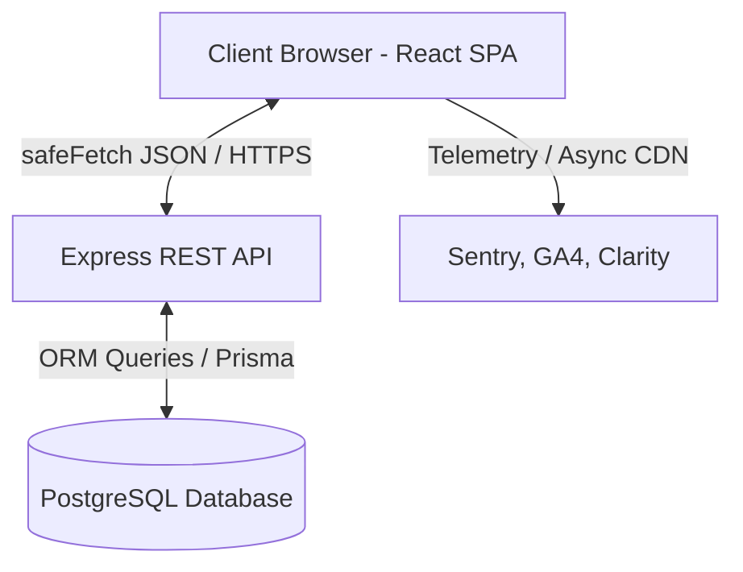

# TypeMentor AI — System Architecture

This guide describes the core architectural patterns of the TypeMentor AI application.

---

## 1. High-Level Flow

TypeMentor AI is a decoupled client-server application:

- **Frontend**: A client-side Single Page Application built on React 18, Vite 5, and Tailwind CSS.
- **Backend**: An Express REST API executing on Node.js.
- **Database**: A PostgreSQL relational database mapped via Prisma ORM.

---

## 2. Key Modules & State Routing

### Telemetry Pipeline
When a user types on the practice board:
1. `TypingEngine.tsx` listens to window key events, updating `useTypingStore` with reaction times and key hold coordinates.
2. `useAICoachPulse` checks speed-accuracy balances every second, triggering local feedback cards if errors rise.
3. On session completion, the metrics are submitted to `POST /api/sessions`.
4. If offline, the session is queued in `localStorage` and automatically synced via `syncOfflineSessions` once the connection returns.

### Layout & Page Swapping
Pages are split using `React.lazy` and nested inside `AppLayout.tsx`. Navigation uses standard `react-router-dom` links. Global auth state is synchronized via `AuthStore.ts` bootstrapping.
